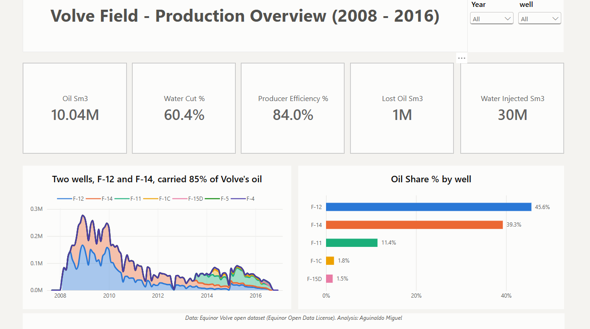
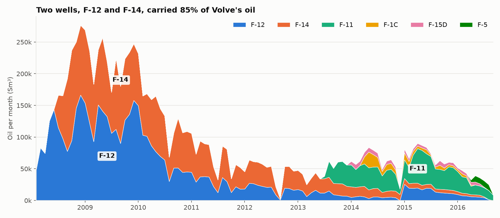
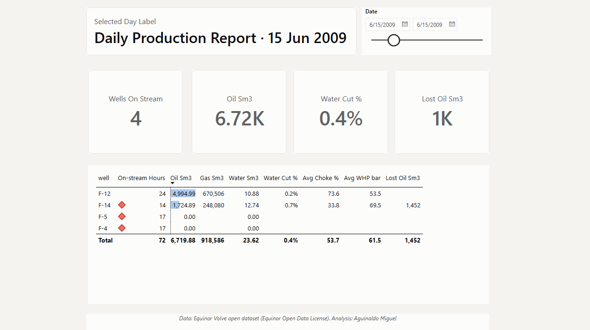

# Volve Field Production Performance

> Which wells sustain field production, when and why did they lose performance (water, pressure, downtime), and how much oil was lost to downtime?

**Status:** data cleaning, SQL KPIs, production analysis and Power BI dashboard done. Decline-curve forecast in progress.





## Key findings so far
| # | Finding | Number |
|---|---|---|
| 1 | Two wells carried the field | F-12 + F-14 = **85%** of the oil |
| 2 | Water arrived early and took over | Water cut passed 10% **13–23 months** after first oil in the original wells; field water cut **above 70%** from 2011 |
| 3 | Downtime was the largest controllable loss | ~**1.0 million Sm³** of oil estimated (~**10%** of production), worst in 2009 at the field's peak |

Details: [`notebooks/02_analysis.ipynb`](notebooks/02_analysis.ipynb) · [Power BI report (PDF)](dashboard/volve_dpr.pdf) · [water cut by well](images/02_water_cut.png) · [downtime loss by year](images/03_downtime_loss.png)

## Business question
A production data analyst at an operator has to answer three questions every day:
1. **Contribution:** which wells drive production?
2. **Well health:** how are water cut, GOR and pressures evolving?
3. **Losses:** how much production is lost to downtime?

This project answers those questions with real daily well data from the Equinor Volve field, as a *Daily Production Report* style analysis.

## Data
- **Source:** Equinor Volve open dataset, *Volve production data.xlsx* (daily production sheet), 2008–2016, North Sea.
  - [Equinor – Volve data sharing](https://www.equinor.com/energy/volve-data-sharing)
  - [Kaggle mirror](https://www.kaggle.com/datasets/lamyalbert/volve-production-data)
- **Licence:** Equinor Open Data Licence. Educational and research use, with attribution to Equinor and the Volve licence partners.
- The raw file is **not** stored in this repo. Download it and place it in `data/raw/`.

## Power BI — Daily Production Report
Four pages: field overview, well health, downtime & losses, and a **daily report** that shows each well's hours, volumes, choke and pressures for a chosen day, like an operator's morning report. Model, measures and theme: [`dashboard/`](dashboard/).



## Approach
Cleaning (Python) → KPIs (SQL, DuckDB) → Analysis and decline curves (Python) → Dashboard (Power BI)

Planned KPIs:

| KPI | Definition |
|---|---|
| Oil, gas and water volumes | Per well and field, monthly |
| Water cut | water / (oil + water) |
| GOR | gas / oil |
| Operational efficiency | on-stream hours / 24 |
| Estimated downtime loss | lost hours × average hourly rate on full days |

## Tools
Python (pandas, scipy, matplotlib) · SQL (DuckDB) · Power BI

## Repository structure
```
data/raw/         original data (not tracked: download from source)
data/processed/   cleaned data
notebooks/        01_cleaning → 02_analysis → 03_decline
sql/              KPI queries
src/              reusable Python functions
dashboard/        Power BI file + PDF export
images/           dashboard screenshots
```

## How to reproduce
```bash
pip install -r requirements.txt
```
Then download the data into `data/raw/` and run the notebooks in order.

## About me
**Aguinaldo Miguel** — Automation & Control Engineer | Data Analytics for Oil & Gas Operations and Supply Chain · Luanda, Angola · [LinkedIn](https://linkedin.com/in/agmiguel)

---
*Code: MIT License. Data: © Equinor and the Volve licence partners, under the Equinor Open Data Licence.*
